# NanoCore Reversing

## Introduction

I’ve decided to publish my reversing methodology when handling various malware sample. Most of the sample that I use come from public website that allow sample sharing. This article is my first, but I hope that it will offer insight on my works as well as – potentially – help other malware analyst. As I want to improve myself in static analysis, I will try to limit the usage of dynamic analysis tools – including the usage of automated sandbox.

So, today special guest will be: “88179697-fceb-11e7-a16e-80e65024849a.file.zip” downloaded from DasMalwerk.eu, which has a detection of 58/67 on VirusTotal: https://www.virustotal.com/en/file/ea721b83c12fd31e7df6bbf8d1516c663046cc809e6fa2672b27b3b6c113bf23/analysis/1516267540/
SHA1: 7add1d715851eca2875c6617999a58ba7ceca118
SHA256:  ea721b83c12fd31e7df6bbf8d1516c663046cc809e6fa2672b27b3b6c113bf23

## Process

At first, I found that this is a .NET application:

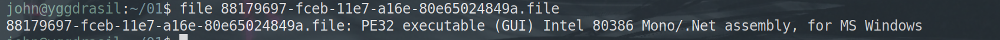

Using PeStudio, I had the confirmation that this is a .NET application, based on the signature and the unique import of mscoree.dll (Microsoft CIL Runtime Agent):

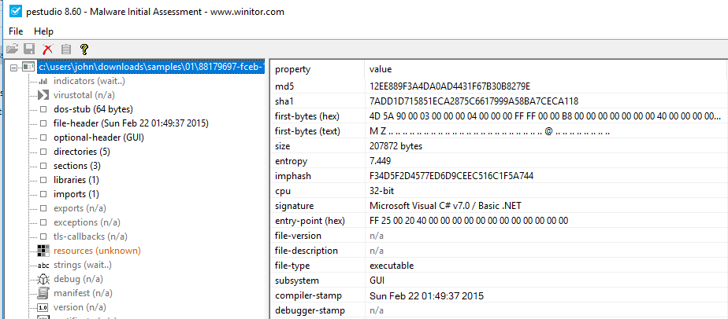
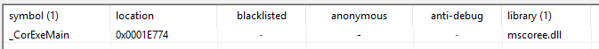

Also, an unknown resource is present in the file itself, which is a bit suspicious, maybe another executable? Looking into the resource itself, it doesn’t look like an executable – The magic bytes are “10 00 00 00”.

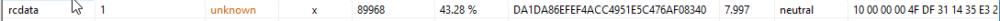

Nevertheless, this resource, named “1” represent 43% of the file itself and have a high entropy, so it is clearly interesting, but encrypted / packed. Let’s dive deeper.
Regarding the string, I found some interesting information related to the type of malware this could be. Multiple instance of “NanoCore” strings directed me to a well-known RAT named NanoCore. Also, there was some string directing to various crypto method (Rijndael, rfc2898 – PBKDF2 - & DES). Finally, there was also method related to the resource management, pointing again in the direction of the unknown resource.

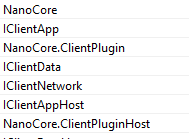
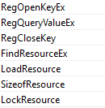
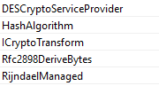

Now, to extract the configuration of a NanoCore RAT I could have used RATDecoder (https://github.com/kevthehermit/RATDecoders), but I wanted to know more about the sample and learn a thing or two in reversing .NET application.
Consequently, the next step was to look directly as the code and as this malware is coded in C#, I will be dealing with CIL (the common language of the .NET framework) instead of assembly.

Firing ILSpy (https://github.com/icsharpcode/ILSpy), the first look is not very promising, as this sample appears to be obfuscated:

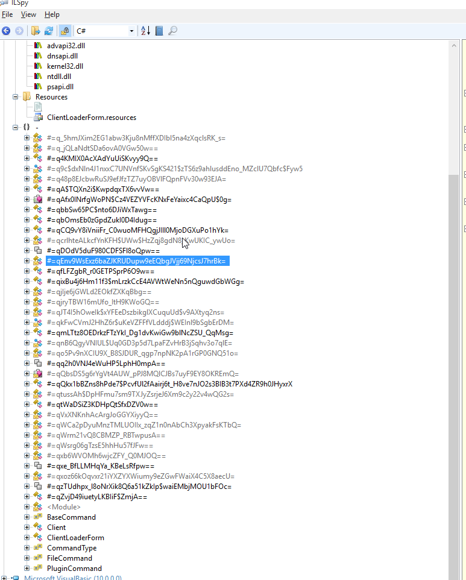

Using de4dot (https://github.com/0xd4d/de4dot) allowed me to deobfuscate most of the code.

Remembering the previous string found, I searched for the resource inclusion and management, which directed me to the following piece of code:

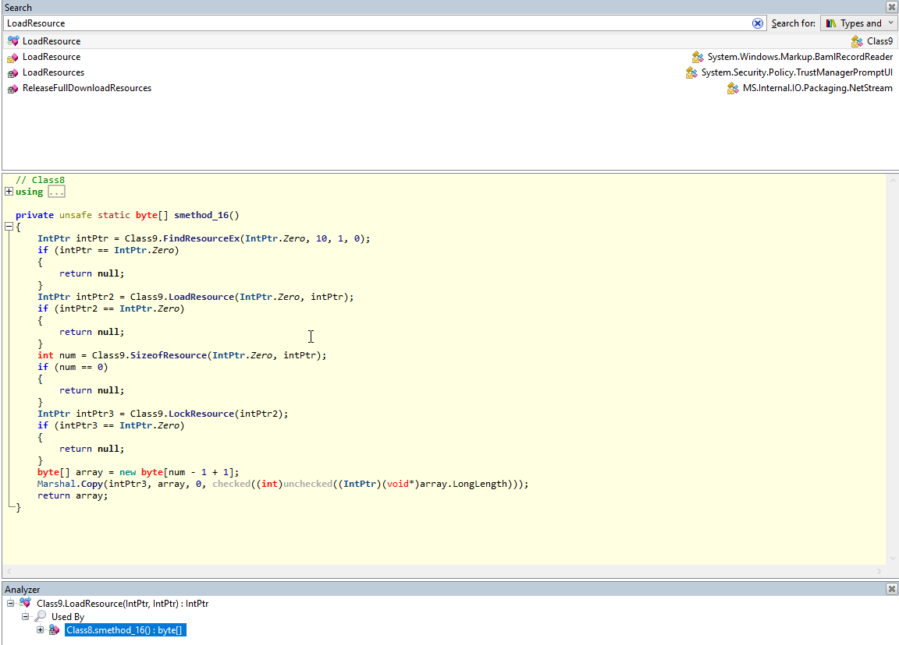

By looking in the MSDN for the usage of these method, I found that this piece of code will:
* Find a specific resource: FindResourceEx takes 4 arguments:
    * A handle to the module which contain the resource, if this is NULL – which is the case here IntPtr.Zero is not strictly equivalent to NULL but as a function argument is treated as null – the function will search the module used to create the current process: our binary.
    * The resource type: 10 is RT_RCDATA
    * The name of the resource, which is 1.
    * The language of the resource, which is irrelevant.
    This will be our “unknown” resource discovered in PEStudio.
* Load and lock the resource
* Return the array containing the resource.

This method is only called at one place:

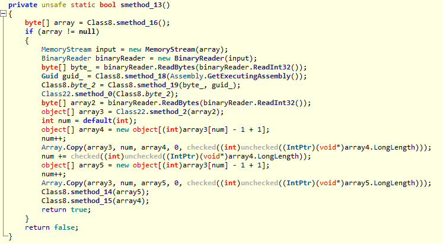

This loaded resource is in the “array” variable. It is read via a BinaryReader and two specific method: “Class8.smethod_18” at first and then “Class22.smethod_2”.

The first part of the above code will perform the following actions in order:
* Extract an Int32 from the BinaryReader
* Read a number of bytes from the stream based on the previously extracted value
* Extract a GUID from the assembly
* Pass the GUID and the bytes read to the Class8_smethod19
* Execute the Class22_smethod0 based on the result of the previous method.
* Read another Int32 from the binary reader
* Read again, a number of byte from the stream based on the previously extracted Int32
* Execute the Class22.smethod_2 on the obtained array  

The first value that is read by the code will be 4 bytes (an Int32):

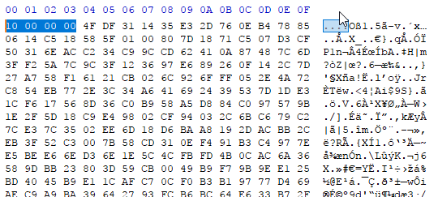

These four bytes, will be treated as an Integer and represent the size of the next value to read. “10 00 00 00” in little endian hexadecimal is “16” as an integer. The next step will be to read 16 bytes from the resource:

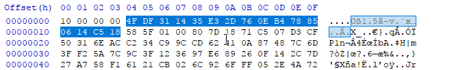

And to obtain the GUID from the assembly:

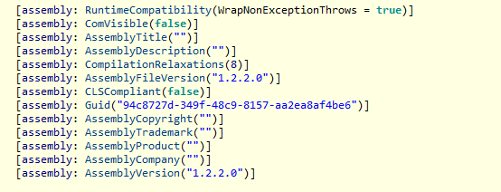

Both values are given to the next method:

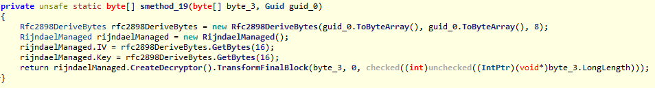

This method performs the following actions:
* Create a PBKDF2 password-base key derivative function with the following argument:
  * The password is the GUID
  * The Salt is the GUID
  * The number of iteration is 8
* Get 16 bytes and set them as an AES-CBC IV and Key.
* Return the 16 bytes array argument passed to the function, decrypted based on the previous IV and Key.

As we will see in the next method, this decrypted information is used as key and IV for the configuration decryption, in the “class22.smethod_0”.

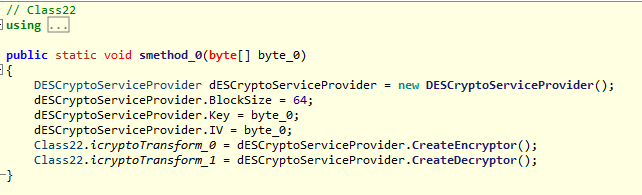

Finally, as discussed earlier, another Int32 is read from the resource, and used as the length for the next ReadBytes method. This part of the resource is the length:

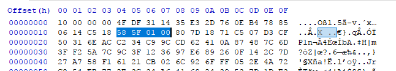

The length of this particular configuration file is equal to: 89.944. Which actually correspond to the end of the resource / configuration file. Finally, the array containing the encrypted configuration is passed to the method Class22.smethod_2:

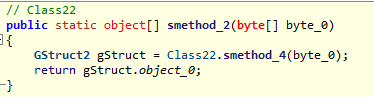

Which only redirect us to the Class22.smethod_4:

So finally, we can see that the object at Class22.icryptoTransform_1 – which is the “decryptor” previously created – is used to decrypt the configuration.

Afterwards, the method read the decrypted stream depending on the value of the next byte read.

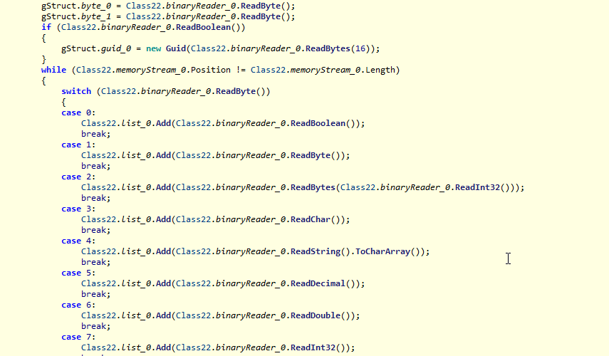

So, I wrote a quick and dirty Python implementation of this code to decrypt the configuration and run it. I just walked through the decrypted configuration – via hexdump – to obtain the C&C & other configuration information. I also added a way to extract any bytes array found, to ensure that I can extract any dropped file contained in the decrypted resource.

## Results

In the end of the analysis, I discovered three files contained in the resource :
*	A DLL file, without any obfuscation:
  *	Sha1: 874b7c3c97cc5b13b9dd172fec5a54bc1f258005
* A second DLL file, using the same Eazfuscator than the previous binary:
	* 874f3caf663265f7dd18fb565d91b7d915031251
*	A XML configuration file to create a scheduled task.

And the following configuration items :
*	Keyboard Logging: True
*	Version: 1.2.2.0 (The same as the one in the assembly actually)
*	Mutex: e18901cb1966824a8d966670de7445f2
*	Group: r
*	Primary Connection Host: 185.145.45.223
*	Backup Connection Host: 127.0.0.1
*	Connection port: 1199
*	Run on startup: True
*	Request Elevation: False
*	Bypass UAC : True
*	Bypass UAC Data : The XML configuration file previously mentioned, which is using the Windows Task Scheduler to start the process with the highest privilege available
*	Clear Zone Identifier: True
*	Clear Access Control: True
*	Set Critical Process: True
*	Prevent System Sleep: True
*	Activate Away Mode: True
*	Enable Debug Mode: False
*	Run Delay: 0
*	Connect Delay: 4.000
*	Restart Delay: 5.000
*	Timeout Interval: 5.000
*	Keep Alive Timeout: 30.000
*	Mutex Timeout: 5.000
*	Lan Timeout: 2.500
*	Set Custom DNS Servers: True
*	Primary DNS Server: 8.8.8.8
*	Backup DNS Server: 8.8.8.4
